<p align="center">
  
</p>

<p align="center">
  <strong>A browser-based design tool for posters, banners, and social media visuals</strong>
</p>

<p align="center">
  <a href="https://novy-grafyniq.vercel.app/" target="_blank">Live Demo</a>
</p>

<p align="center">
  
  
  
  
  
  
  
  
  
</p>

---

## About

Novy-Grafyniq is a Canva-style design tool that runs entirely in the browser. Users create posters, banners, and social media graphics on an interactive canvas — placing shapes, text, and images — then save the design to the cloud, export it as a PNG/PDF, or come back to it later from any device.

It is a MERN application: a React (Vite) single-page app for the canvas editor, and a Node.js/Express REST API backed by MongoDB Atlas, with Cloudinary handling image storage.

---

## Features

| Feature | What it does |
|---|---|
| Canvas Editor | Canva-based drag-and-drop surface — add, move, resize, and layer rectangles, circles, ellipses, lines, text, and images |
| Undo / Redo | Full history control while editing, implemented as a snapshot stack in Redux |
| Image Uploads | Import images from the user's device directly onto the canvas |
| Text Tools | Add and style text (font family, size, bold/italic, color) |
| Cloud Save | Designs are saved as structured data + a rendered thumbnail, retrievable from any device |
| Export | Download the current canvas as a PNG or PDF, entirely client-side |
| Secure Authentication | Email/password (JWT) or Google Sign-In; each user's designs are private to their account |
| Template Gallery | Browse admin-curated design templates by category |
| Admin Dashboard | Role-gated views for managing all designs, templates, and users |
| Responsive Design | Built with Tailwind CSS across desktop, tablet, and mobile |

---

## Tech Stack

| Layer | Technology | Purpose |
|---|---|---|
| Frontend framework | React 19 + Vite, React Router v7 | SPA shell and client-side routing |
| Canvas engine | Konva + react-konva, use-image | The actual drawing surface — shapes, drag/resize, transforms |
| State management | Redux Toolkit + redux-persist | Global state for user session, saved designs, and live canvas shapes |
| Styling | Tailwind CSS v4 | Utility-first styling, responsive layout |
| Export | html2canvas, jsPDF, file-saver | Client-side PNG/PDF export of the canvas |
| Auth (client) | @react-oauth/google, jwt-decode, axios | Google Sign-In widget, token handling, API calls |
| Backend runtime | Node.js + Express | REST API server |
| Database | MongoDB Atlas via Mongoose | Stores users, designs, templates |
| Media storage | Cloudinary | Stores rendered PNG snapshots of designs and template images |
| Auth (server) | jsonwebtoken, bcryptjs, google-auth-library | Issues/verifies JWTs, hashes passwords, verifies Google ID tokens |
| Deployment | Vercel (frontend), Render (backend), MongoDB Atlas (DB) | Hosting |

> Note: the frontend is a Vite + React SPA (not Next.js) — this replaces the earlier tech-stack listing.

---

## Project Structure

```
Fullstack_Final_Project/
├─ backend/
│  ├─ server.js                     # Express app entry — CORS, JSON body limit, route mounting
│  ├─ Config/
│  │  ├─ db.js                      # Mongoose connection to MongoDB Atlas
│  │  └─ cloudinary.js              # Cloudinary SDK config
│  ├─ Models/
│  │  ├─ User.js                    # username/email/password(hashed)/role/googleId
│  │  ├─ Designs.js                 # name, Shapes[] (Mixed), createdBy, thumbnailUrl, assetUrl, cloudinaryPublicId
│  │  └─ Template.js                # name, category, imageUrl, cloudinaryPublicId
│  ├─ Routes/
│  │  ├─ auth.js                    # /register, /login, /admin-login, /google-login
│  │  ├─ designs.js                 # CRUD for a user's own designs (owner/admin checks inline)
│  │  ├─ admin.js                   # admin-only: all designs, templates, user management
│  │  └─ templates.js               # public read-only template listing
│  └─ src/utilities/
│     ├─ index.js                   # authenticateToken — verifies JWT, populates req.user
│     └─ authenticateAdmin.js       # wraps authenticateToken, then checks role === "admin"
├─ frontend/
│  ├─ src/
│  │  ├─ main.jsx                   # Router + Redux Provider + PersistGate — app entry
│  │  ├─ store/
│  │  │  ├─ store.js                # combines reducers, persists only the `user` slice
│  │  │  ├─ userSlice.js            # current user, isAdmin flag, admin's user list
│  │  │  ├─ designSlice.js          # async thunks: fetch/create/update/delete a design
│  │  │  └─ shapesSlice.js          # live canvas shapes + undo/redo history/future stacks
│  │  ├─ Canvas/
│  │  │  ├─ Editor.jsx              # the canvas itself — Konva Stage/Layer, shape factories, save/export
│  │  │  └─ EditNavbar.jsx          # toolbar: add shape, color/font controls, save/export/undo buttons
│  │  ├─ pages/                     # route-level screens: Dashboard, Editor, Templates, About, Admin*, Users
│  │  ├─ Login/, Register/          # auth forms + Google login button
│  │  ├─ Cards/                     # DesignCard (dashboard tile), UserCard (admin user list)
│  │  ├─ Header/, Components/       # Navbar, AdminNavbar, Layout (Outlet wrapper)
│  │  └─ utils/axiosinstance.js     # axios instance; interceptor attaches Bearer token from sessionStorage
│  └─ vercel.json                   # Vite SPA rewrite rules for Vercel
├─ package.json
└─ README.md
```

---

## How the Website Works

This section explains things in plain language, using simple diagrams instead of technical system-design notation. A quick note on words used below:

- **Frontend** = what you see and click in the browser (built with React).
- **Backend / Server** = the program that does the real work behind the scenes (built with Node.js/Express).
- **Token** = a kind of digital pass you get after logging in, so you don't have to re-enter your password for every action.

### 1. The big picture

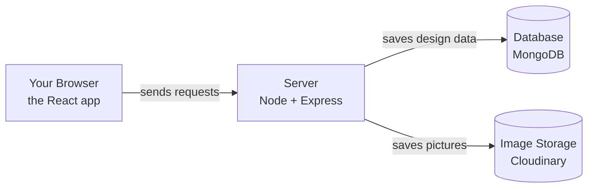

Your browser never talks to the database or image storage directly. It always asks the server, and the server does the actual saving.

### 2. What each part of the code does

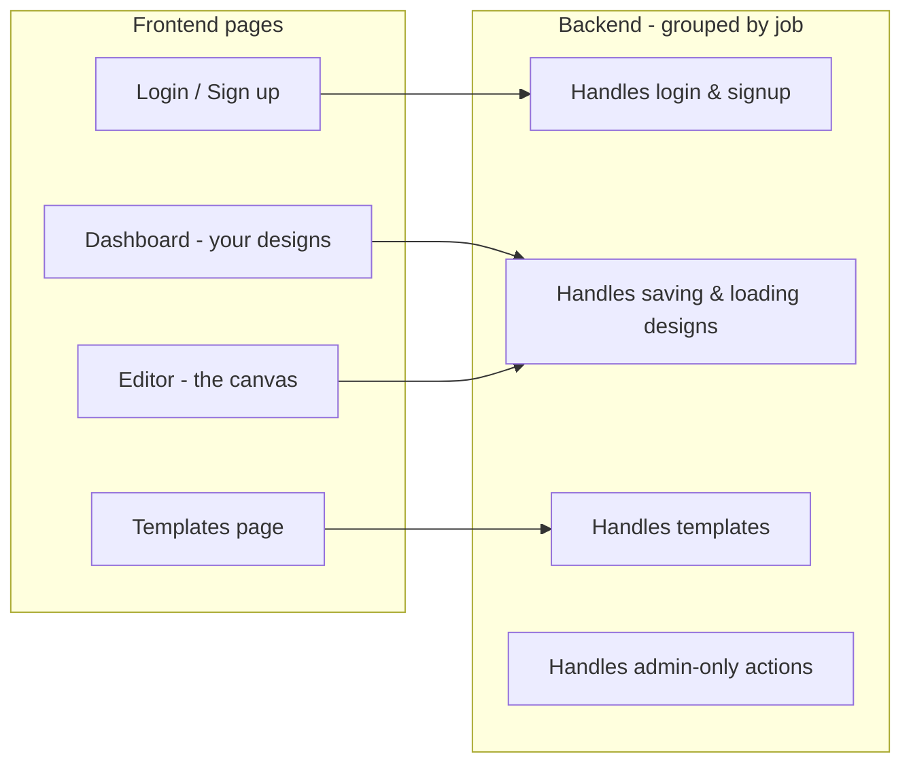

Each page on the frontend talks to one matching part of the backend. This is a simple, useful thing to say in an interview: "my Login page talks to the auth part of the backend, my Editor talks to the designs part," and so on.

### 3. Logging in

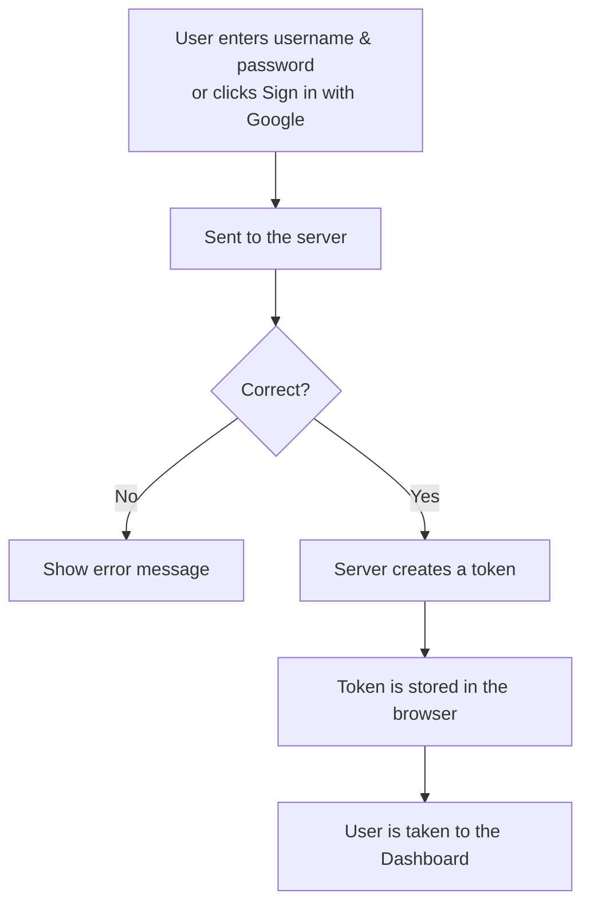

Whether you log in with a password or with Google, the end result is the same: the server gives you a token, and the browser remembers it.

### 4. Using your token

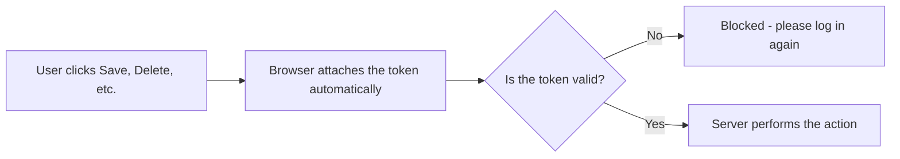

You don't have to log in again for every click — the browser quietly attaches your token to every request behind the scenes.

### 5. What the app remembers while you use it

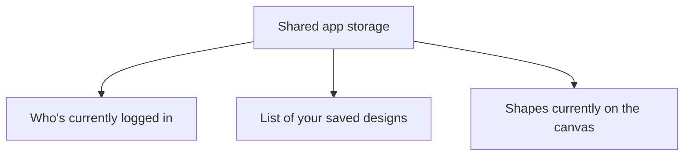

This shared storage is called **Redux**. Think of it as one box that every screen of the app can look into, instead of each screen having to ask for the same information separately.

### 6. Undo / Redo

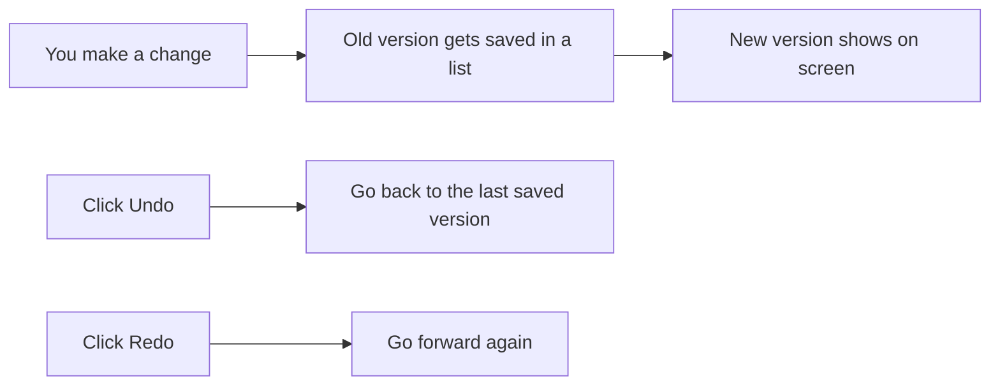

It's just a list of "before" snapshots. Undo steps backward through the list; redo steps forward again.

### 7. Saving a design

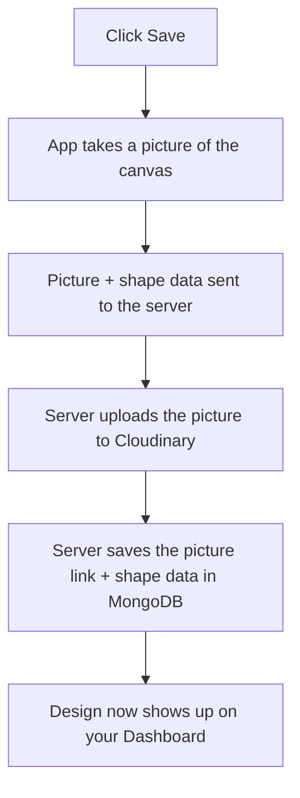

Two things get saved together: the actual shapes (so you can reopen and keep editing), and a picture (so the Dashboard has something to show as a preview).

### 8. Opening a saved design

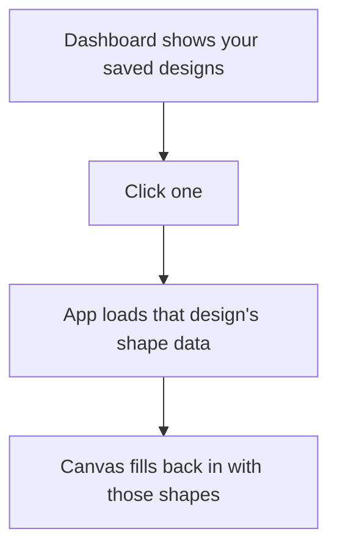

### 9. Exporting as PNG or PDF

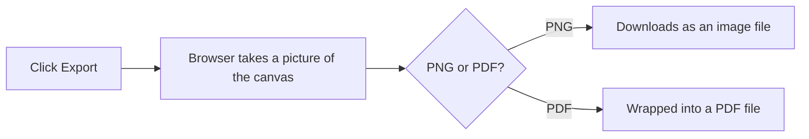

Export is different from Save — it never touches the server at all. Everything happens right there in your browser.

### 10. Regular user vs. Admin

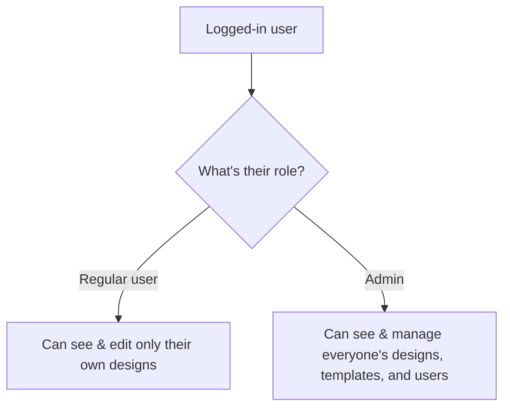

---

## Local Setup

### Backend

```bash
cd backend
npm install
```

Create a `.env` file in `backend/` (see `.env.example`):

```
MONGO_URI=<your MongoDB Atlas URI>
CLOUDINARY_CLOUD_NAME=<your cloud name>
CLOUDINARY_API_KEY=<your api key>
CLOUDINARY_API_SECRET=<your api secret>
JWT_SECRET=<your secret key>
GOOGLE_CLIENT_ID=<your google oauth client id>
FRONTEND_URL=https://novy-grafyniq.vercel.app
PORT=3000
```

```bash
npm start
```

### Frontend

```bash
cd frontend
npm install
```

Create a `.env` file in `frontend/` (see `.env.example`):

```
VITE_API_BASE_URL=http://localhost:3000
VITE_GOOGLE_CLIENT_ID=<your google oauth client id>
```

```bash
npm run dev
```

Open `http://localhost:5173` in your browser.

---

## Team & Contributions

Built as a 2-person collaboration, split cleanly by layer:

| Contributor | Role |
|---|---|
| **Noor Aisha** | Frontend — canvas editor, drag-and-drop interface, undo/redo, image upload UI, text tools, responsive design, client-side auth integration |
| **Davidica Asare** | Backend — Node.js/Express API, MongoDB schemas, authentication logic, cloud-save endpoints |

---

## Future Enhancements

- Route-level auth guards (a shared `PrivateRoute`/`AdminRoute` wrapper instead of per-page checks)
- Wire the Template Gallery into the editor (click a template → load its shapes onto the canvas)
- Consolidate the duplicate auth-middleware implementations and the currently-unused `controllers/` files into the actual `Routes/` logic
- Dark / light theme toggle
- Real-time collaborative editing via WebSockets
- Analytics dashboard for usage tracking
  
  
  
  
  
</p>

---

## About

Novy-Grafyniq is a Canva-style design tool that runs entirely in the browser. Users create posters, banners, and social media graphics on an interactive canvas — placing shapes, text, and images — then save the design to the cloud, export it as a PNG/PDF, or come back to it later from any device.

It is a MERN application: a React (Vite) single-page app for the canvas editor, and a Node.js/Express REST API backed by MongoDB Atlas, with Cloudinary handling image storage.

---

## Features

| Feature | What it does |
|---|---|
| Canvas Editor | Konva-based drag-and-drop surface — add, move, resize, and layer rectangles, circles, ellipses, lines, text, and images |
| Undo / Redo | Full history control while editing, implemented as a snapshot stack in Redux |
| Image Uploads | Import images from the user's device directly onto the canvas |
| Text Tools | Add and style text (font family, size, bold/italic, color) |
| Cloud Save | Designs are saved as structured data + a rendered thumbnail, retrievable from any device |
| Export | Download the current canvas as a PNG or PDF, entirely client-side |
| Secure Authentication | Email/password (JWT) or Google Sign-In; each user's designs are private to their account |
| Template Gallery | Browse admin-curated design templates by category |
| Admin Dashboard | Role-gated views for managing all designs, templates, and users |
| Responsive Design | Built with Tailwind CSS across desktop, tablet, and mobile |

---

## Tech Stack

| Layer | Technology | Purpose |
|---|---|---|
| Frontend framework | React 19 + Vite, React Router v7 | SPA shell and client-side routing |
| Canvas engine | Konva + react-konva, use-image | The actual drawing surface — shapes, drag/resize, transforms |
| State management | Redux Toolkit + redux-persist | Global state for user session, saved designs, and live canvas shapes |
| Styling | Tailwind CSS v4 | Utility-first styling, responsive layout |
| Export | html2canvas, jsPDF, file-saver | Client-side PNG/PDF export of the canvas |
| Auth (client) | @react-oauth/google, jwt-decode, axios | Google Sign-In widget, token handling, API calls |
| Backend runtime | Node.js + Express | REST API server |
| Database | MongoDB Atlas via Mongoose | Stores users, designs, templates |
| Media storage | Cloudinary | Stores rendered PNG snapshots of designs and template images |
| Auth (server) | jsonwebtoken, bcryptjs, google-auth-library | Issues/verifies JWTs, hashes passwords, verifies Google ID tokens |
| Deployment | Vercel (frontend), Render (backend), MongoDB Atlas (DB) | Hosting |

> Note: the frontend is a Vite + React SPA (not Next.js) — this replaces the earlier tech-stack listing.

---

## Project Structure

```
Fullstack_Final_Project/
├─ backend/
│  ├─ server.js                     # Express app entry — CORS, JSON body limit, route mounting
│  ├─ Config/
│  │  ├─ db.js                      # Mongoose connection to MongoDB Atlas
│  │  └─ cloudinary.js              # Cloudinary SDK config
│  ├─ Models/
│  │  ├─ User.js                    # username/email/password(hashed)/role/googleId
│  │  ├─ Designs.js                 # name, Shapes[] (Mixed), createdBy, thumbnailUrl, assetUrl, cloudinaryPublicId
│  │  └─ Template.js                # name, category, imageUrl, cloudinaryPublicId
│  ├─ Routes/
│  │  ├─ auth.js                    # /register, /login, /admin-login, /google-login
│  │  ├─ designs.js                 # CRUD for a user's own designs (owner/admin checks inline)
│  │  ├─ admin.js                   # admin-only: all designs, templates, user management
│  │  └─ templates.js               # public read-only template listing
│  └─ src/utilities/
│     ├─ index.js                   # authenticateToken — verifies JWT, populates req.user
│     └─ authenticateAdmin.js       # wraps authenticateToken, then checks role === "admin"
├─ frontend/
│  ├─ src/
│  │  ├─ main.jsx                   # Router + Redux Provider + PersistGate — app entry
│  │  ├─ store/
│  │  │  ├─ store.js                # combines reducers, persists only the `user` slice
│  │  │  ├─ userSlice.js            # current user, isAdmin flag, admin's user list
│  │  │  ├─ designSlice.js          # async thunks: fetch/create/update/delete a design
│  │  │  └─ shapesSlice.js          # live canvas shapes + undo/redo history/future stacks
│  │  ├─ Canvas/
│  │  │  ├─ Editor.jsx              # the canvas itself — Konva Stage/Layer, shape factories, save/export
│  │  │  └─ EditNavbar.jsx          # toolbar: add shape, color/font controls, save/export/undo buttons
│  │  ├─ pages/                     # route-level screens: Dashboard, Editor, Templates, About, Admin*, Users
│  │  ├─ Login/, Register/          # auth forms + Google login button
│  │  ├─ Cards/                     # DesignCard (dashboard tile), UserCard (admin user list)
│  │  ├─ Header/, Components/       # Navbar, AdminNavbar, Layout (Outlet wrapper)
│  │  └─ utils/axiosinstance.js     # axios instance; interceptor attaches Bearer token from sessionStorage
│  └─ vercel.json                   # Vite SPA rewrite rules for Vercel
├─ package.json
└─ README.md
```

---

## System Architecture & Data Flow

### 1. High-level architecture

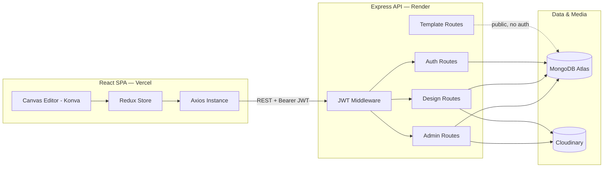

The frontend never talks to MongoDB or Cloudinary directly — every write goes through the Express API, secured by an explicit CORS origin allowlist (not a wildcard).

### 2. Which file calls which route

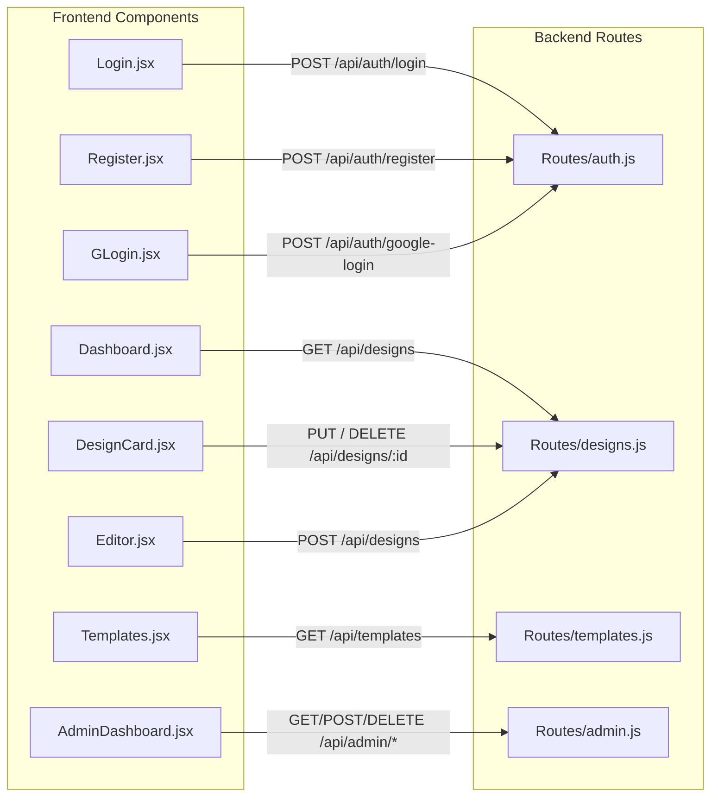

### 3. Authentication flow

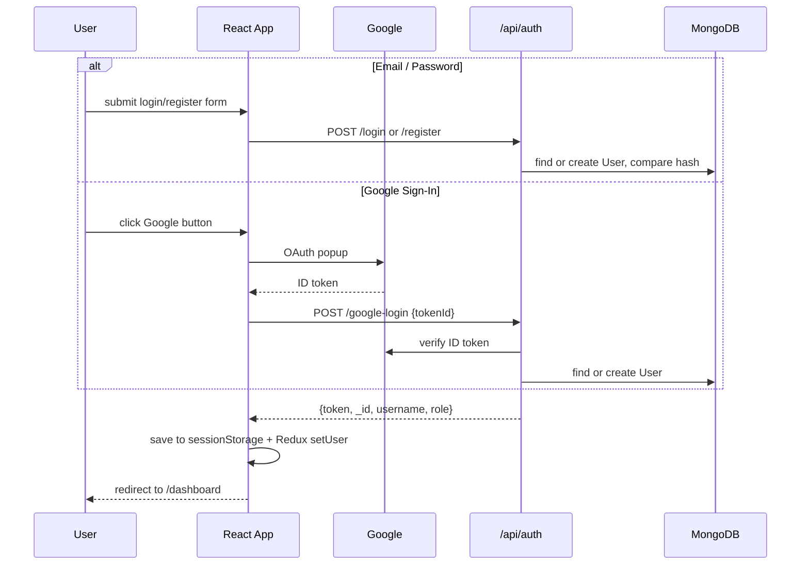

Every later request is authenticated the same way — one `axiosInstance` interceptor reads the token from `sessionStorage` and attaches `Authorization: Bearer <token>` automatically.

### 4. Request authorization (middleware)

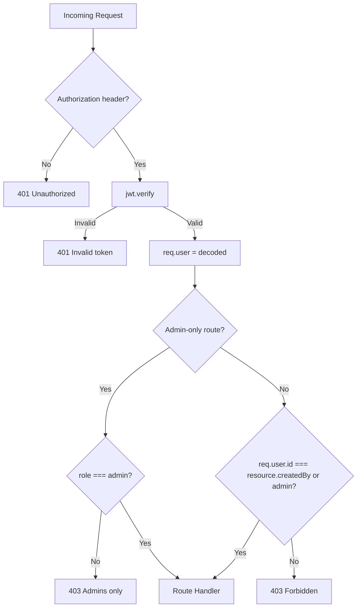

### 5. Redux state shape

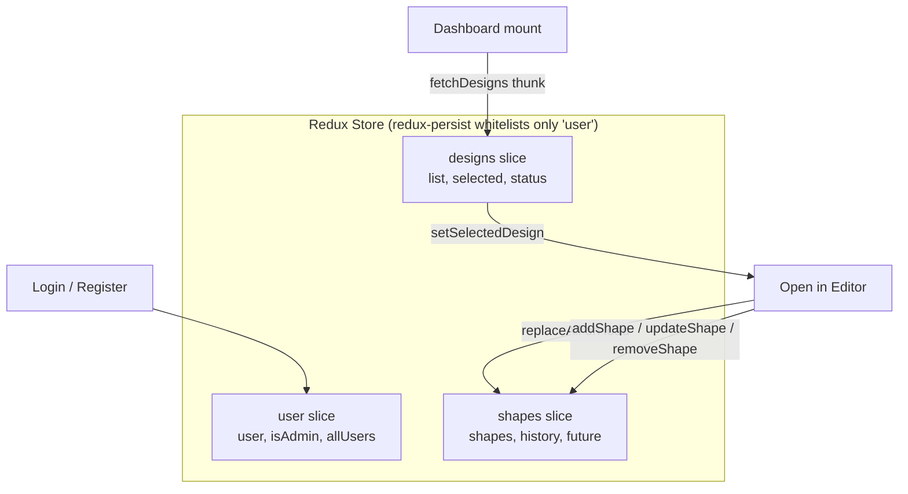

`shapes` is intentionally left out of persistence — it's live editor state, re-hydrated fresh from a saved design each time.

### 6. Undo / redo

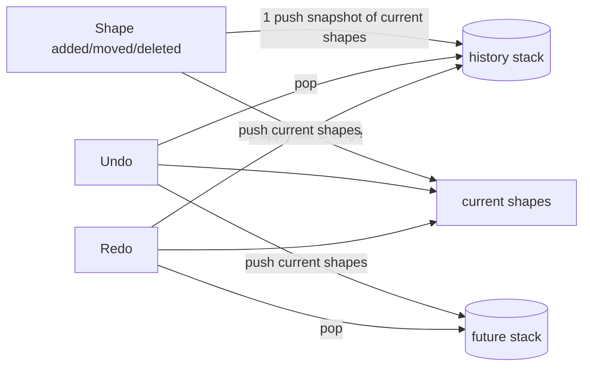

A snapshot-stack pattern (`JSON.stringify` of the whole shapes array), not a diff/patch system — simple to explain, though memory grows with edit count.

### 7. Save flow (dual persistence)

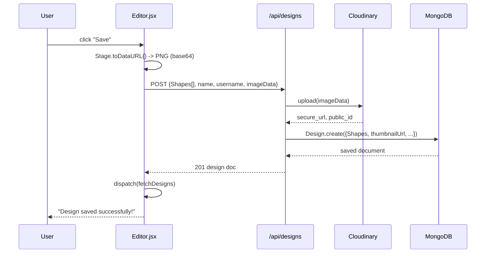

Two things travel together on save: the **Shapes array** (vector data, so the design stays re-editable) and the **rasterized PNG** (so the dashboard thumbnail renders instantly without re-drawing the canvas).

### 8. Load flow

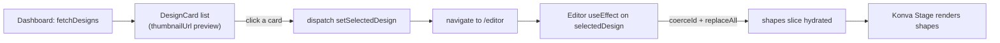

### 9. Export flow — contrast with save

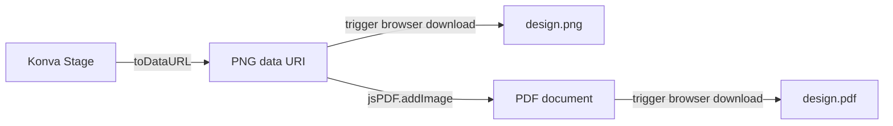

Same rasterization step as Save, but export never calls the backend at all — everything happens client-side.

### 10. Roles & admin surface

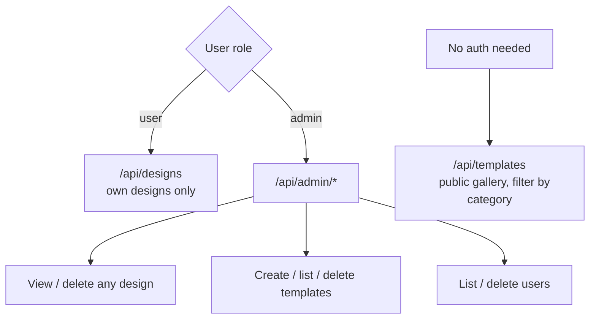

---

## Local Setup

### Backend

```bash
cd backend
npm install
```

Create a `.env` file in `backend/` (see `.env.example`):

```
MONGO_URI=<your MongoDB Atlas URI>
CLOUDINARY_CLOUD_NAME=<your cloud name>
CLOUDINARY_API_KEY=<your api key>
CLOUDINARY_API_SECRET=<your api secret>
JWT_SECRET=<your secret key>
GOOGLE_CLIENT_ID=<your google oauth client id>
FRONTEND_URL=https://novy-grafyniq.vercel.app
PORT=3000
```

```bash
npm start
```

### Frontend

```bash
cd frontend
npm install
```

Create a `.env` file in `frontend/` (see `.env.example`):

```
VITE_API_BASE_URL=http://localhost:3000
VITE_GOOGLE_CLIENT_ID=<your google oauth client id>
```

```bash
npm run dev
```

Open `http://localhost:5173` in your browser.

---

## Team & Contributions

Built as a 2-person collaboration, split cleanly by layer:

| Contributor | Role |
|---|---|
| **Noor Aisha** | Frontend — canvas editor, drag-and-drop interface, undo/redo, image upload UI, text tools, responsive design, client-side auth integration |
| **Davidica Asare** | Backend — Node.js/Express API, MongoDB schemas, authentication logic, cloud-save endpoints |

---

## Future Enhancements

- Route-level auth guards (a shared `PrivateRoute`/`AdminRoute` wrapper instead of per-page checks)
- Wire the Template Gallery into the editor (click a template → load its shapes onto the canvas)
- Consolidate the duplicate auth-middleware implementations and the currently-unused `controllers/` files into the actual `Routes/` logic
- Dark / light theme toggle
- Real-time collaborative editing via WebSockets
- Analytics dashboard for usage tracking
  
  
  
  
  
</p>

---

## About

Novy-Grafyniq is a Canva-style design tool that runs entirely in the browser. Users can create posters, banners, and social media graphics without installing any software — just an interactive canvas, image uploads, text customization, and cloud-saved projects accessible from any device.

It's built as a full-stack MERN application, with Next.js on the frontend for performance and React for the interactive canvas editor.

---

## Features

| Feature | What it does |
|---|---|
| Canvas Editor | Drag-and-drop design surface — place, move, and layer elements freely |
| Undo / Redo | Full history control while editing a design |
| Image Uploads | Import images directly from the user's device into a design |
| Text Tools | Add and customize text with different fonts, colors, and sizes |
| Cloud Save | Designs are saved to the backend and accessible from any device, any time |
| Secure Authentication | JWT-based login, so each user's designs stay private to their account |
| Responsive Design | Works across desktop, tablet, and mobile |

---

## Tech Stack

<p align="center">
  
  
  
  
  
  
  
</p>

| Layer | Technology |
|---|---|
| Frontend | React + Next.js |
| Backend | Node.js + Express |
| Database | MongoDB (MongoDB Atlas) |
| Auth | JWT |
| Deployment | Frontend on Vercel, backend on Render |

---

## Project Structure

```
Novy-Grafyniq/
├─ backend/                # Node.js + Express API
│  ├─ controllers/         # Route logic
│  ├─ models/               # MongoDB schemas
│  ├─ routes/               # API endpoints
│  ├─ config/                # DB and environment config
│  └─ server.js             # Backend entry point
├─ frontend/               # Next.js + React frontend
│  ├─ pages/                 # React pages
│  ├─ components/          # Reusable UI components
│  └─ styles/                # CSS / Tailwind styles
├─ package.json
└─ README.md
```

---

## Local Setup

### Backend

```bash
cd backend
npm install
```

Create a `.env` file in `backend/`:
```
PORT=5000
MONGO_URI=<your MongoDB Atlas URI>
JWT_SECRET=<your secret key>
```

Run the backend:
```bash
npm start
```

### Frontend

```bash
cd frontend
npm install
npm run dev
```

Open `http://localhost:3000` in your browser.

---

## Team & Contributions

This was built as a 2-person collaboration, split cleanly by layer:

| Contributor | Role |
|---|---|
| [**Noor Aisha**](https://github.com/NoorAisha25) | Frontend — canvas editor, drag-and-drop interface, undo/redo, image upload UI, text tools, responsive design, client-side auth integration |
| [**Davidica Asare**](https://github.com/dav-cfg) | Backend — Node.js/Express API, MongoDB schemas, authentication logic, cloud-save endpoints |

<div align="center">
<table>
  <tr>
    <td align="center">
      <a href="https://github.com/NoorAisha25">
        <br />
        <sub><b>Noor Aisha</b></sub>
      </a>
    </td>
    <td align="center">
      <a href="https://github.com/dav-cfg">
        <br />
        <sub><b>Davidica Asare</b></sub>
      </a>
    </td>
  </tr>
</table>
</div>

---

## Future Enhancements

- Dark / light theme toggle
- Role-based access control
- A content-management layer for reusable design templates
- Analytics dashboard for usage tracking
- Real-time collaborative editing via WebSockets
